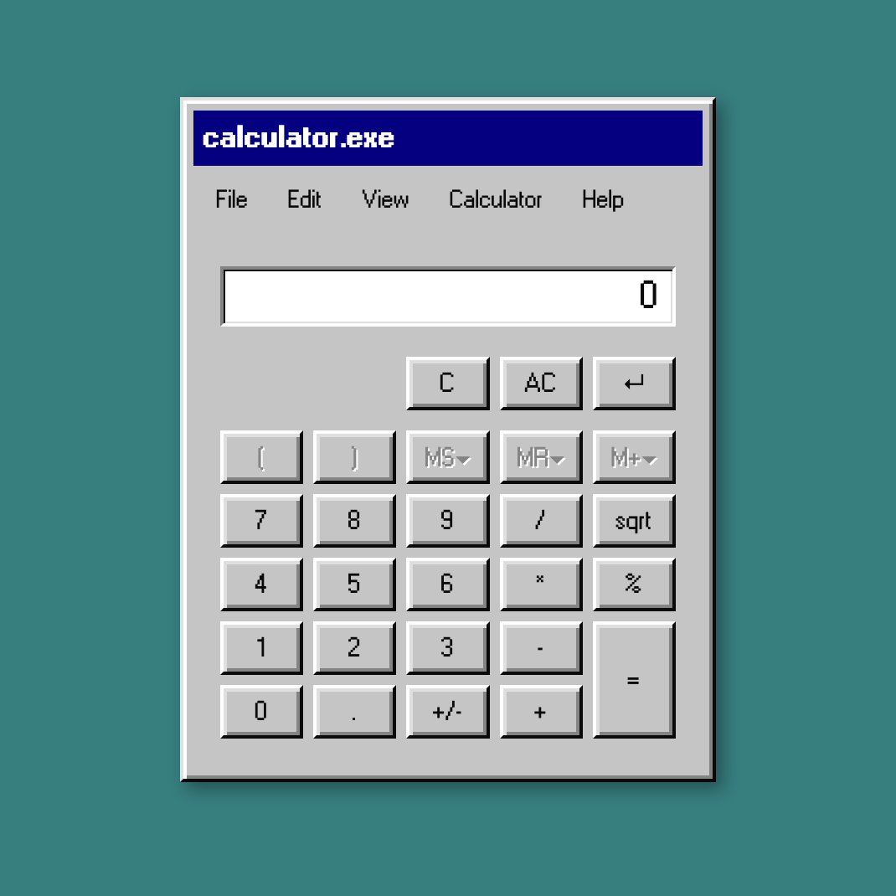

# calculator.exe

A painfully nostalgic Windows 95 calculator built with react95



<br>

<a href="https://maestriny.github.io/calculator.exe">
  
  <b> Try it here</b>
</a>

## Features

- Basic operations: `+`, `-`, `*`, `/`
- Decimal input support
- `C`, `AC`, backspace
- Sign toggle (`+/-`)
- Square root (`sqrt`)
- Percentage (`%`)
- Basic error handling (for example division by zero) and a React `ErrorBoundary`

## How to run

Prerequisites:

- Node.js (18+ recommended)
- npm

Commands:

```bash
npm install
npm start
```

Then open `http://localhost:3000`.

Other useful commands:

```bash
npm run build
```

## Tech stack

- React 18
- react95
- styled-components
